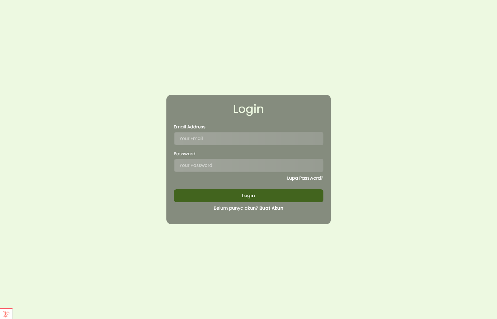
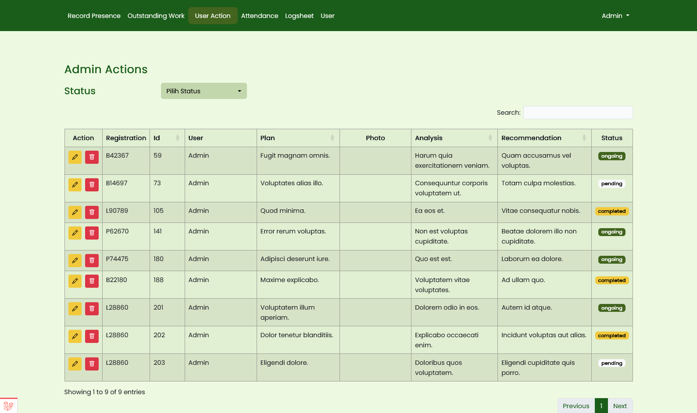

<p align="center"><a href="https://laravel.com" target="_blank"></a></p>

## About App



Attendance app to manage attendance of employees in a company. The app has some features like: 

- Authentication
- Image upload for attendance records
- CRUD operations for employees
- CRUD operations for attendance
- CRUD operations for action plans
- Chart for action plans
- Datatable for employees, attendance and action plans

## Installation


Before you proceed with the installation, make sure you have the following installed on your machine:

- [PHP](https://www.php.net/downloads.php)
- [Composer](https://getcomposer.org/download/)
- [Node.js](https://nodejs.org/en/download/)
- [Code Editor](https://code.visualstudio.com/download)



1. Clone the repo by running the command below in your terminal, and then `cd` into the folder created
   
    ```bash
    git clone https://github.com/nichiyoo/attendance-app.git [folder-name]
    cd [folder-name]
    ```

2. Install composer dependencies and npm dependencies

    ```bash
    composer install
    npm install
    ```

3. Create a copy of your `.env` file

    ```bash
    cp .env.example .env
    ```

    or if you are using windows

    ```bash
    copy .env.example .env
    ```

4. Generate an app encryption key for the application and customize the `.env` file

    ```bash
    php artisan key:generate
    ```
    
    You can customize the `.env` file to your taste. For example, you can change the `APP_NAME` to your app name, `DB_DATABASE` to your database name, `DB_USERNAME` to your database username and `DB_PASSWORD` to your database password.
    
    Example for `sqlite` database:
    ```env
    APP_NAME="Attendance App"
    DB_CONNECTION=sqlite 

    // comment the following lines if you are using sqlite database
    DB_HOST=127.0.0.1
    DB_PORT=3306
    DB_DATABASE=laravel
    DB_USERNAME=root
    DB_PASSWORD=
    ```
    
    Example for `mysql` database:
    ```.env
    APP_NAME="Attendance App"
    DB_CONNECTION=mysql
    DB_HOST=127.0.0.1
    DB_PORT=3306
    DB_DATABASE=laravel
    DB_USERNAME=root
    DB_PASSWORD=
    ```

    If you are using `mysql` database, create a database with the name you specified in the `.env` file.

5. Migrate the database

    ```bash
    php artisan migrate
    ```

    If you are using `sqlite` database, artisan will prompt you to create a database file. Just press `Y` and then `Enter` to create the database file. laravel will create a database file in the `database` folder.

6. Seed the database

    ```bash
    php artisan db:seed
    ```

7. Link the storage folder

    ```bash
    php artisan storage:link
    ```

8. Run the npm script to compile the assets

    ```bash
    npm run dev
    ```

9. Open another terminal and run the laravel development server

    ```bash
    php artisan serve
    ```

10. Open your browser and visit `http://localhost:8000` to see the app.
